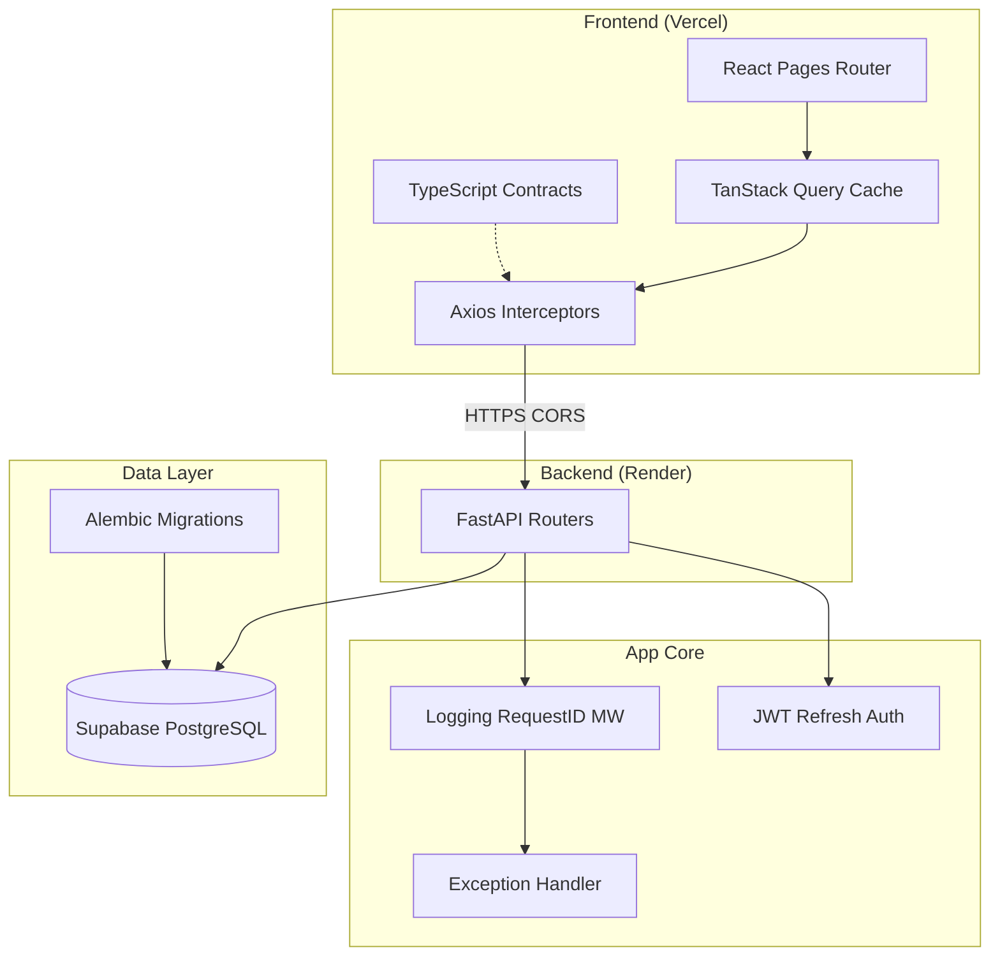

# AtomQuest Hackathon 2026

An in-house goal setting and tracking portal built to eliminate fragmented spreadsheet workflows. The system provides a centralized platform for employee goal alignment, manager approvals, quarterly check-ins, and organization-wide analytics.

**Live Demo:** [https://atomquest-hackathon-ten.vercel.app](https://atomquest-hackathon-ten.vercel.app)

## Demo Access

To evaluate the application, use the **"Select a demo account"** dropdown on the login page to instantly authenticate into pre-populated environments.

If manual login is required, the password for all accounts is `demo123`:
- **Admin:** `admin@hackathon.dev` (Full visibility and analytics)
- **Manager:** `manager1@hackathon.dev` (Team goal approvals)
- **Employee:** `employee3@hackathon.dev` (Goal creation and check-ins)

## Core Features

- **Role-Based Access Control:** Distinct workflows for Employees, Managers, and Admins enforced via JWT.
- **Strict Goal Validation:** Enforces a 100% total weightage requirement before submission.
- **Multi-Metric Tracking:** Supports numeric targets, percentages, timelines, and zero-based (Yes/No) metrics.
- **Approval Workflows:** Managers can review, adjust, approve, or return goal sheets for rework.
- **Analytics Dashboards:** Real-time data visualization of check-in completion rates and organization-wide status using Recharts.

## Tech Stack

- **Frontend:** React (TypeScript), Vite, Tailwind CSS, Shadcn/ui, TanStack Query, React Router
- **Backend:** FastAPI (Python 3.10+), SQLAlchemy (Async), Alembic
- **Database:** PostgreSQL (Supabase)
- **Infrastructure:** Vercel (Frontend), Render (Backend)

## System Architecture



## Local Setup

Ensure you have Node.js, Python 3.10+, and Docker installed.

### Backend Setup

1. Start a local PostgreSQL instance:
```bash
docker-compose up -d db
```

2. Setup Python environment:
```bash
cd backend
python -m venv venv
source venv/bin/activate  # Windows: venv\Scripts\activate
pip install -r requirements.txt
```

3. Configure environment and run migrations:
```bash
cp .env.example .env
alembic upgrade head
python -m app.scripts.seed
```

4. Start the server:
```bash
uvicorn app.main:app --reload
```

### Frontend Setup

1. Install dependencies:
```bash
cd frontend
npm install
```

2. Configure environment:
```bash
cp .env.example .env.local
```

3. Start the development server:
```bash
npm run dev
```
