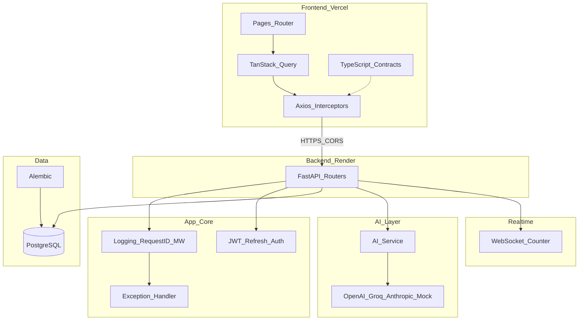

# Hackathon Starter — Architecture & Contracts (Phase 0)

Reusable full-stack hackathon skeleton: React + Vite frontend (Vercel), FastAPI backend (Render), PostgreSQL, optional AI providers, minimal WebSocket demo.

## Phase map

| Phase | Deliverable |
|-------|-------------|
| **0** | Folder tree, Pydantic schemas, TypeScript types, env schema, error standards |
| 1 | Backend core, auth, database, `test_contracts.py` |
| 2 | AI service layer (`app/ai/providers.py`), WebSocket counter (`/api/v1/ws/counter`) |
| 3 | Frontend structure, auth, `validate.test.ts` (optional) |
| 4 | Dashboard, CRUD UI, charts |
| 5 | Docker, Render, Vercel, docker-compose |
| 6 | README, setup guide, Git workflow |

**Phase 0 validation:** TypeScript `npm run typecheck` and Python `import app.schemas` only.

**Phase 1 validation:** `pytest`, `alembic upgrade head`, seed script, `uvicorn app.main:app --reload`, `curl http://localhost:8000/health`.

## System diagram



## Repository layout

```
hackathon-base/
├── .env.example
├── docs/ARCHITECTURE.md
├── backend/
│   ├── requirements.txt
│   └── app/
│       ├── config.py          # Settings (env schema)
│       ├── core/errors.py     # ErrorCode + HTTP map
│       └── schemas/           # Pydantic contracts (source of truth)
└── frontend/
    └── src/types/             # TypeScript mirror
```

**File budget (full project):** max 30 backend files, 25 frontend files. Split deploy — no shared npm package; keep field names identical across `schemas/` and `types/`.

## API response envelopes

### Success

```json
{
  "success": true,
  "data": { },
  "message": null,
  "request_id": "uuid-or-null"
}
```

Generic wrapper: `ApiResponse[T]` in `backend/app/schemas/common.py`, `ApiResponse<T>` in `frontend/src/types/api.ts`.

### Pagination

```json
{
  "success": true,
  "data": [],
  "meta": {
    "page": 1,
    "page_size": 20,
    "total": 100,
    "total_pages": 5
  },
  "request_id": null
}
```

Query defaults: `page=1`, `page_size=20` (max 100). `total_pages = ceil(total / page_size)` (0 when `total` is 0).

### Error

```json
{
  "success": false,
  "error": {
    "code": "NOT_FOUND",
    "message": "Item not found",
    "details": null
  },
  "request_id": null
}
```

| Code | HTTP |
|------|------|
| `VALIDATION_ERROR` | 422 |
| `AUTH_INVALID_CREDENTIALS` | 401 |
| `AUTH_TOKEN_EXPIRED` | 401 |
| `AUTH_TOKEN_INVALID` | 401 |
| `AUTH_FORBIDDEN` | 403 |
| `NOT_FOUND` | 404 |
| `CONFLICT` | 409 |
| `RATE_LIMITED` | 429 |
| `AI_PROVIDER_ERROR` | 502 |
| `INTERNAL_ERROR` | 500 |

Defined in `backend/app/core/errors.py`. Handlers wired in Phase 1.

## Route inventory (contracts)

| Method | Path | Request | Response `data` |
|--------|------|---------|-----------------|
| GET | `/health` | — | `HealthData` |
| POST | `/api/v1/auth/register` | `RegisterRequest` | `AuthUser` |
| POST | `/api/v1/auth/login` | `LoginRequest` | `TokenPair` |
| POST | `/api/v1/auth/refresh` | `RefreshRequest` | `TokenPair` |
| POST | `/api/v1/auth/logout` | — | `LogoutData` |
| GET | `/api/v1/users/me` | — | `AuthUser` |
| GET | `/api/v1/items` | `ItemListParams` | `ItemRead[]` + meta |
| POST | `/api/v1/items` | `ItemCreate` | `ItemRead` |
| GET | `/api/v1/items/{id}` | — | `ItemRead` |
| PATCH | `/api/v1/items/{id}` | `ItemUpdate` | `ItemRead` |
| DELETE | `/api/v1/items/{id}` | — | `DeleteData` |
| POST | `/api/v1/ai/chat` | `ChatRequest` | `ChatResponse` or stream |
| GET | `/api/v1/ai/logs` | `AILogListParams` | `AILogRead[]` + meta |
| WS | `/api/v1/ws/counter` | — | `{ "count": number }` |

All JSON routes return `ApiResponse` or `PaginatedResponse` unless streaming.

## TypeScript ↔ Pydantic parity

| Backend | Frontend |
|---------|----------|
| `app/schemas/common.py` | `src/types/api.ts` |
| `app/schemas/auth.py` | `src/types/auth.ts` |
| `app/schemas/user.py` | `src/types/user.ts` |
| `app/schemas/item.py` | `src/types/item.ts` |
| `app/schemas/ai.py` | `src/types/ai.ts` |
| `app/config.py` | `ImportMetaEnv` in `api.ts` |

Datetime fields serialize as ISO 8601 strings in JSON; TypeScript uses `string`.

## Environment variables

See [`.env.example`](../.env.example). Backend loads via `app.config.Settings` (pydantic-settings). Frontend uses `VITE_API_URL` and `VITE_WS_URL`.

## Validation commands

### Phase 0

```bash
cd backend && pip install -r requirements.txt
PYTHONPATH=. python -c "from app.schemas import *; from app.config import Settings"

cd frontend && npm install && npm run typecheck
```

### Phase 1

```bash
# Start Postgres (from repo root)
docker compose up -d db

cd backend
pip install -r requirements.txt
alembic upgrade head
python -m app.scripts.seed
uvicorn app.main:app --reload

# Health + auth smoke test
curl http://localhost:8000/health
curl -X POST http://localhost:8000/api/v1/auth/login \
  -H "Content-Type: application/json" \
  -d '{"email":"demo1@hackathon.dev","password":"demo123"}'

pytest
```
