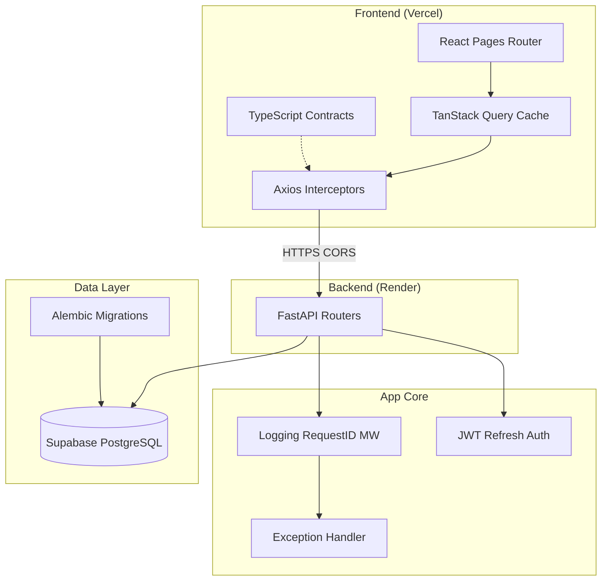

# AtomQuest Hackathon 2026 - Submission Document

**Team Member:** YuvaShankar

## 1. Live Working Link
**Production URL:** [https://atomquest-hackathon-ten.vercel.app](https://atomquest-hackathon-ten.vercel.app)

*Note to Judges: To evaluate the portal, you can either use the **"Select a demo account"** dropdown on the login page to instantly sign in, or manually enter the credentials below. All passwords are `demo123`.*
* **Admin:** `admin@hackathon.dev` (View all goal sheets & analytics)
* **Manager:** `manager1@hackathon.dev` (Review & approve team goals)
* **Employee:** `employee3@hackathon.dev` (Create goals & submit check-ins)

## 2. Source Code Repository
**GitHub Repository:** [https://github.com/YuvaShankar-Y/atomquest-hackathon](https://github.com/YuvaShankar-Y/atomquest-hackathon)

---

## 3. Architecture Diagram & System Design

The AtomQuest platform is built as a robust, scalable, full-stack web application designed for enterprise goal management and tracking.

### Tech Stack
*   **Frontend:** React (TypeScript), Vite, Tailwind CSS, shadcn/ui, TanStack Query, Recharts.
*   **Backend:** FastAPI (Python), SQLAlchemy, asyncpg.
*   **Database:** PostgreSQL (Supabase).
*   **Hosting:** Vercel (Frontend), Render (Backend).

### System Diagram

### Data Flow & Workflow
1.  **Authentication & Sessions**: A strictly typed JWT-based authentication system handles sessions. User roles (Employee, Manager, Admin) determine route access and strictly isolate data visibility.
2.  **API Communication**: The React frontend uses `Axios` interceptors for seamless JWT token refresh. `TanStack Query` caches server state (e.g., goal sheets, approval states) locally to prevent redundant data fetching and provide instant UI feedback.
3.  **Database Strategy**: A normalized PostgreSQL schema models complex hierarchical relationships (Users → Managers) and lifecycle states (Goal Cycles → Goal Sheets → Goals → Check-ins).
4.  **Analytics**: Org-wide aggregated metrics are processed securely on the backend via parameterized SQL queries and visualized on the frontend using responsive `Recharts` graphs.
